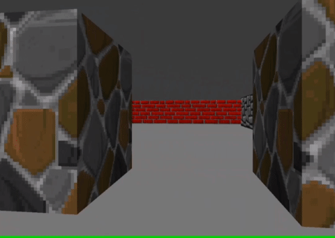

# 3D visualization

3D visualization is a GUI application where the user can move in a house-like environment. 3D visualization is built with Java Swing 2D graphics. The app draws the graphics using the raycasting algorithm explained [here](https://lodev.org/cgtutor/raycasting.html).

3D visualization was a first-year CS project and was built for the Aalto University course Programming Studio.



The directory structure is as follows:
```
.
├── pics
│   ├── colorstone.png
│   ├── greystone.png
│   └── redbrick.png
├── src
│   └── main
│       └── scala
│           └── raycasting
│               ├── Game.scala
│               ├── Player.scala
│               ├── Renderer.scala
│               ├── Screen.scala
│               └── Texture.scala
├── Map.txt
├── README.md
├── build.sbt
└── demo.gif
```

## Prerequisites

- Install Scala, check the [docs](https://www.scala-lang.org/download/). First, install Java 8 (or 11) and then Scala build tool (sbt).

## Running the application

After cloning the repo and installing prerequisites, `cd` to the project directory and run
```
sbt
```
to open the sbt console. Run the app with typing
```
run
```
to the sbt console.
